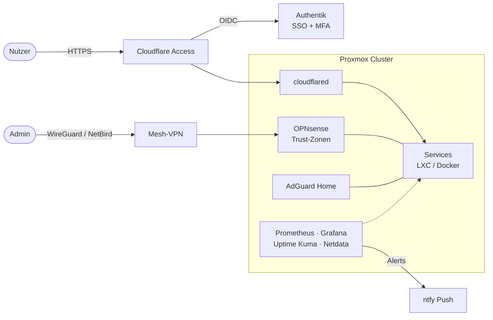

<h1 align="center">Phillip Völkel</h1>

  <b>Infrastructure & DevOps Engineer · Self-Hosting · Security · Automation</b> 
  Ich plane, betreibe und automatisiere Infrastruktur, die sicher, nachvollziehbar und wartbar ist.

  
  
  

---

## Über mich

Ich betreibe einen Multi-Node-Proxmox-Cluster als produktionsnahe Umgebung und nutze ihn als Labor für das, was ich
auch für Kunden umsetze: virtualisierte Infrastruktur, containerisierte Dienste, identitätsbasierter Zugriff,
Monitoring mit Alerting und automatisierte Betriebsabläufe.

Mit **Synvix** biete ich diese Erfahrung als Dienstleistung an – von Hosting und Cloud-Infrastruktur über
Netzwerk- und Security-Konzepte bis zu Automatisierung und ERPNext.

**Worauf ich Wert lege**

- **Security by Design** – Zero Trust, MFA und Least Privilege von Anfang an, nicht nachträglich
- **Observability** – jeder Dienst wird überwacht, jeder Ausfall meldet sich selbst
- **Reproduzierbarkeit** – Skripte, Konfiguration als Code und Dokumentation statt Handarbeit
- **Datensouveränität** – Self-Hosting und Hosting in DE/EU, DSGVO-konform gedacht

---

## Schwerpunkte

| Bereich | Was ich konkret mache |
|---|---|
| **Virtualisierung & Hosting** | Proxmox-Cluster (VMs + LXC), Docker/Compose, Service-Isolation, Update- und Backup-Strategien |
| **Netzwerk & Zugriff** | OPNsense, segmentierte Trust-Zonen, WireGuard/NetBird-Mesh, Cloudflare Tunnel & Access |
| **Identity & Security** | Authentik (SSO, MFA), Fail2ban, Hardening, Login-Alerting, DNS-Filterung |
| **Monitoring & Alerting** | Prometheus, Grafana, Uptime Kuma, Netdata, Push-Benachrichtigungen via ntfy |
| **Automatisierung** | Bash- und Python-Skripte, n8n-Workflows, API-Integrationen |
| **Business-Anwendungen** | ERPNext, Nextcloud, Paperless-ngx – Self-Hosted statt SaaS-Abhängigkeit |

---

## Tech-Stack

**Infrastruktur**

**Netzwerk & Security**

**Monitoring**

**Development & Automation**

<b>Self-Hosted Services im Betrieb</b>

 

| Kategorie | Dienste |
|---|---|
| Identität & Secrets | Authentik, Vaultwarden, Password Pusher |
| Zusammenarbeit & Dokumente | Nextcloud, Rocket.Chat, BookStack, Paperless-ngx, Stirling-PDF, Linkwarden |
| Business | ERPNext |
| Automatisierung | n8n, Home Assistant, ntfy |
| Betrieb & Wartung | Portainer, Dozzle, Tugtainer, IT-Tools |
| Netzwerk | AdGuard Home, Cloudflare Tunnel |

---

## Referenzarchitektur: mein Homelab

- **Keine offenen Inbound-Ports:** Öffentliche Dienste laufen ausschließlich über ausgehende Cloudflare-Tunnel.
- **Identität vor Netzwerk:** Zugriff wird über Authentik + MFA entschieden, nicht über die IP-Adresse.
- **Segmentierung:** OPNsense trennt Management, Services und Clients in eigene Zonen.
- **Admin-Zugriff:** nur über das verschlüsselte Mesh-VPN, nie direkt aus dem Internet.
- **Selbstmeldend:** Ausfälle und verdächtige Logins werden sofort per Push gemeldet.

---

## Aktuelle Projekte

| Projekt | Beschreibung | Status |
|---|---|---|
| **Synvix Cloud Hub** | Automatisierte Bereitstellung von Hosting-Umgebungen | 🚧 Beta |
| **Secure Login Alerts** | Erkennung von SSH-/System-Logins mit Echtzeit-Push via ntfy (Bash) | ✅ Produktiv |
| **Homelab Automation Toolkit** | Skripte & Policies für Failover, Backup und Wiederherstellung | 🧪 Test |
| **Web Dev Playground** | UI-Experimente mit modernen Webkomponenten | 🔄 Überarbeitung |

---

## GitHub

  
  

---

## Kontakt

  
  

  
  
  

Offen für Projekte rund um Infrastruktur, Self-Hosting, Security und Automatisierung.

---

<b>Secure. Automate. Innovate.</b>

